# RICK TRADING SYSTEM - ARCHITECTURE MAP

**Generated:** 2025-10-13 15:20:08

## System Overview

- **Total Nodes:** 19
- **Data Flows:** 26
- **Operational:** 19
- **Failed:** 0

## Architecture Diagram

```mermaid
graph TB

    subgraph frontend[FRONTEND LAYER]
        Dashboard_UI[✅ Dashboard_UI<br/>endpoint]
        API_Status[✅ API_Status<br/>endpoint]
        API_Narration[✅ API_Narration<br/>endpoint]
        Companion_Overlay[✅ Companion_Overlay<br/>endpoint]
    end

    subgraph api[API LAYER]
        Mode_Manager[✅ Mode_Manager<br/>service]
        Narration_Logger[✅ Narration_Logger<br/>service]
        Capital_Manager[✅ Capital_Manager<br/>service]
    end

    subgraph business[BUSINESS LAYER]
        Ghost_Engine[✅ Ghost_Engine<br/>engine]
        Canary_Engine[✅ Canary_Engine<br/>engine]
        Smart_Logic[✅ Smart_Logic<br/>service]
        Regime_Detector[✅ Regime_Detector<br/>service]
        Risk_Control[✅ Risk_Control<br/>service]
        Session_Breaker[✅ Session_Breaker<br/>service]
    end

    subgraph data[DATA LAYER]
        Narration_File[✅ Narration_File<br/>logger]
        PnL_File[✅ PnL_File<br/>logger]
        Progress_File[✅ Progress_File<br/>logger]
        Capital_Tracking[✅ Capital_Tracking<br/>logger]
    end

    subgraph external[EXTERNAL LAYER]
        OANDA_Connector[✅ OANDA_Connector<br/>connector]
        Coinbase_Connector[✅ Coinbase_Connector<br/>connector]
    end

    %% Data Flows
    Dashboard_UI -->|request| API_Status
    Dashboard_UI -->|request| API_Narration
    Companion_Overlay -->|request| API_Narration
    API_Status -->|query| Mode_Manager
    API_Status -->|query| Narration_Logger
    API_Narration -->|query| Narration_Logger
    Narration_Logger -->|write| Narration_File
    Narration_Logger -->|write| PnL_File
    Capital_Manager -->|write| Capital_Tracking
    Ghost_Engine -->|log_event| Narration_Logger
    Ghost_Engine -->|query| Capital_Manager
    Ghost_Engine -->|signal_processing| Smart_Logic
    Ghost_Engine -->|compliance_check| Risk_Control
    Ghost_Engine -->|stop_check| Session_Breaker
    Canary_Engine -->|log_event| Narration_Logger
    Canary_Engine -->|query| Capital_Manager
    Canary_Engine -->|signal_processing| Smart_Logic
    Canary_Engine -->|compliance_check| Risk_Control
    Ghost_Engine -->|place_trade| OANDA_Connector
    Ghost_Engine -->|get_price| Coinbase_Connector
    Canary_Engine -->|place_trade| OANDA_Connector
    Canary_Engine -->|get_price| Coinbase_Connector
    Smart_Logic -->|signal| Ghost_Engine
    Regime_Detector -->|regime_info| Ghost_Engine
    Risk_Control -->|risk_limits| Ghost_Engine
    Session_Breaker -->|stop_signal| Ghost_Engine
```

## Node Details

### API_Narration

- **Type:** endpoint
- **Layer:** frontend
- **Status:** operational
- **Last Check:** 2025-10-13T15:20:08.315819
- **Connections Out:** 1
- **Connections In:** 2

**Sends Data To:**
- → Narration_Logger

**Receives Data From:**
- ← Dashboard_UI
- ← Companion_Overlay

**Metadata:**
- route: `/api/narration`
- file: `dashboard/app.py`

---

### API_Status

- **Type:** endpoint
- **Layer:** frontend
- **Status:** operational
- **Last Check:** 2025-10-13T15:20:08.315745
- **Connections Out:** 2
- **Connections In:** 1

**Sends Data To:**
- → Mode_Manager
- → Narration_Logger

**Receives Data From:**
- ← Dashboard_UI

**Metadata:**
- route: `/api/status`
- file: `dashboard/app.py`

---

### Canary_Engine

- **Type:** engine
- **Layer:** business
- **Status:** operational
- **Last Check:** 2025-10-13T15:20:08.316673
- **Connections Out:** 6
- **Connections In:** 0

**Sends Data To:**
- → Narration_Logger
- → Capital_Manager
- → Smart_Logic
- → Risk_Control
- → OANDA_Connector
- → Coinbase_Connector

**Metadata:**
- engine_file: `canary_trading_engine.py`
- mode: `CANARY`
- description: `45-minute validation session`

---

### Capital_Manager

- **Type:** service
- **Layer:** api
- **Status:** operational
- **Last Check:** 2025-10-13T15:20:08.316392
- **Connections Out:** 1
- **Connections In:** 2

**Sends Data To:**
- → Capital_Tracking

**Receives Data From:**
- ← Ghost_Engine
- ← Canary_Engine

**Metadata:**
- module: `capital_manager.py`
- functions: `['get_current_capital', 'calculate_leverage', 'get_monthly_projection']`

---

### Capital_Tracking

- **Type:** logger
- **Layer:** data
- **Status:** operational
- **Last Check:** 2025-10-13T15:20:08.317639
- **Connections Out:** 0
- **Connections In:** 1

**Receives Data From:**
- ← Capital_Manager

**Metadata:**
- log_file: `capital_tracking.json`
- format: `JSON`
- purpose: `Capital and leverage tracking`

---

### Coinbase_Connector

- **Type:** connector
- **Layer:** external
- **Status:** operational
- **Last Check:** 2025-10-13T15:20:08.317860
- **Connections Out:** 0
- **Connections In:** 2

**Receives Data From:**
- ← Ghost_Engine
- ← Canary_Engine

**Metadata:**
- module: `brokers/coinbase_connector.py`
- environment: `Sandbox`
- api: `Coinbase Advanced Trade API`

---

### Companion_Overlay

- **Type:** endpoint
- **Layer:** frontend
- **Status:** operational
- **Last Check:** 2025-10-13T15:20:08.315863
- **Connections Out:** 1
- **Connections In:** 0

**Sends Data To:**
- → API_Narration

**Metadata:**
- component: `JavaScript companion window`
- features: `['chat', 'hive_mind', 'narration']`

---

### Dashboard_UI

- **Type:** endpoint
- **Layer:** frontend
- **Status:** operational
- **Last Check:** 2025-10-13T15:20:08.315661
- **Connections Out:** 2
- **Connections In:** 0

**Sends Data To:**
- → API_Status
- → API_Narration

**Metadata:**
- route: `/`
- file: `dashboard/app.py`
- description: `Main trading dashboard with live metrics`

---

### Ghost_Engine

- **Type:** engine
- **Layer:** business
- **Status:** operational
- **Last Check:** 2025-10-13T15:20:08.316518
- **Connections Out:** 7
- **Connections In:** 4

**Sends Data To:**
- → Narration_Logger
- → Capital_Manager
- → Smart_Logic
- → Risk_Control
- → Session_Breaker
- → OANDA_Connector
- → Coinbase_Connector

**Receives Data From:**
- ← Smart_Logic
- ← Regime_Detector
- ← Risk_Control
- ← Session_Breaker

**Metadata:**
- engine_file: `ghost_trading_charter_compliant.py`
- mode: `GHOST`
- description: `Charter-compliant ghost trading with 15 breakpoints`

---

### Mode_Manager

- **Type:** service
- **Layer:** api
- **Status:** operational
- **Last Check:** 2025-10-13T15:20:08.316049
- **Connections Out:** 0
- **Connections In:** 1

**Receives Data From:**
- ← API_Status

**Metadata:**
- module: `util/mode_manager.py`
- functions: `['get_mode_info', 'switch_mode']`

---

### Narration_File

- **Type:** logger
- **Layer:** data
- **Status:** operational
- **Last Check:** 2025-10-13T15:20:08.317332
- **Connections Out:** 0
- **Connections In:** 1

**Receives Data From:**
- ← Narration_Logger

**Metadata:**
- log_file: `narration.jsonl`
- format: `JSON Lines`
- purpose: `Event logging`

---

### Narration_Logger

- **Type:** service
- **Layer:** api
- **Status:** operational
- **Last Check:** 2025-10-13T15:20:08.316198
- **Connections Out:** 2
- **Connections In:** 4

**Sends Data To:**
- → Narration_File
- → PnL_File

**Receives Data From:**
- ← API_Status
- ← API_Narration
- ← Ghost_Engine
- ← Canary_Engine

**Metadata:**
- module: `util/narration_logger.py`
- functions: `['log_narration', 'log_pnl', 'get_latest_narration', 'get_session_summary']`

---

### OANDA_Connector

- **Type:** connector
- **Layer:** external
- **Status:** operational
- **Last Check:** 2025-10-13T15:20:08.317750
- **Connections Out:** 0
- **Connections In:** 2

**Receives Data From:**
- ← Ghost_Engine
- ← Canary_Engine

**Metadata:**
- module: `brokers/oanda_connector.py`
- environment: `Practice`
- api: `OANDA v20 REST API`

---

### PnL_File

- **Type:** logger
- **Layer:** data
- **Status:** operational
- **Last Check:** 2025-10-13T15:20:08.317414
- **Connections Out:** 0
- **Connections In:** 1

**Receives Data From:**
- ← Narration_Logger

**Metadata:**
- log_file: `pnl.jsonl`
- format: `JSON Lines`
- purpose: `Trade P&L tracking`

---

### Progress_File

- **Type:** logger
- **Layer:** data
- **Status:** operational
- **Last Check:** 2025-10-13T15:20:08.317503
- **Connections Out:** 0
- **Connections In:** 0

**Metadata:**
- log_file: `foundation/progress.json`
- format: `JSON`
- purpose: `System progress tracking`

---

### Regime_Detector

- **Type:** service
- **Layer:** business
- **Status:** operational
- **Last Check:** 2025-10-13T15:20:08.316953
- **Connections Out:** 1
- **Connections In:** 0

**Sends Data To:**
- → Ghost_Engine

**Metadata:**
- module: `logic/regime_detector.py`
- description: `Market regime detection`

---

### Risk_Control

- **Type:** service
- **Layer:** business
- **Status:** operational
- **Last Check:** 2025-10-13T15:20:08.317052
- **Connections Out:** 1
- **Connections In:** 2

**Sends Data To:**
- → Ghost_Engine

**Receives Data From:**
- ← Ghost_Engine
- ← Canary_Engine

**Metadata:**
- module: `risk/risk_control_center.py`
- description: `Charter compliance and risk management`

---

### Session_Breaker

- **Type:** service
- **Layer:** business
- **Status:** operational
- **Last Check:** 2025-10-13T15:20:08.317168
- **Connections Out:** 1
- **Connections In:** 1

**Sends Data To:**
- → Ghost_Engine

**Receives Data From:**
- ← Ghost_Engine

**Metadata:**
- module: `risk/session_breaker.py`
- description: `Stop-loss and session termination`

---

### Smart_Logic

- **Type:** service
- **Layer:** business
- **Status:** operational
- **Last Check:** 2025-10-13T15:20:08.316855
- **Connections Out:** 1
- **Connections In:** 2

**Sends Data To:**
- → Ghost_Engine

**Receives Data From:**
- ← Ghost_Engine
- ← Canary_Engine

**Metadata:**
- module: `logic/smart_logic.py`
- description: `Trade decision logic and signal processing`

---
